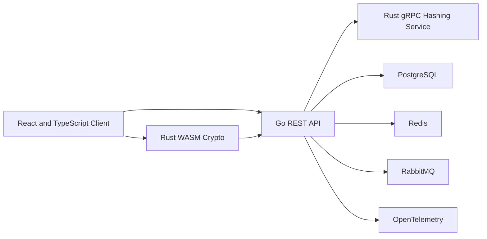

# VaultForge

VaultForge is a backend-first developer secrets vault built to demonstrate secure API design, authentication, PostgreSQL engineering, cross-language service integration, distributed systems, and browser-side cryptography.

The project is designed for an individual developer storing API keys, environment variables, database connection details, login records, and secure notes.

> VaultForge is a portfolio and learning project, not an audited password manager. Use synthetic data only.

## Architecture

VaultForge separates account authentication from vault encryption.



### Account authentication

The Go API receives the account password during registration and login. Password operations pass through a replaceable `PasswordHasher` interface.

The current development implementation uses a local Argon2id adapter. A later Rust gRPC service will replace it without changing the HTTP contracts or authentication service.

### Vault encryption

Vault encryption is a separate future browser-side workflow.

A Rust WebAssembly module will derive and manage vault encryption keys in the browser. The Go API must never receive the vault master passphrase, an unwrapped vault key, or decrypted vault contents.

## Current state

The current backend supports:

- Account registration
- Account login
- Argon2id password hashing with random salts
- Generic invalid-credential responses
- PostgreSQL persistence and migrations
- Database-backed readiness checks
- Strict JSON request handling and body limits
- Safe structured logging
- Real PostgreSQL and authentication integration tests

Authentication currently validates credentials but does not issue sessions or tokens. Session management is the next backend phase.

Frontend, Redis, RabbitMQ, Rust services, WebAssembly cryptography, and vault CRUD are intentionally deferred until their roadmap phases.

## Technology

- **Backend:** Go, Chi, pgx, Zap
- **Database:** PostgreSQL
- **Authentication:** Argon2id through a replaceable hasher interface
- **Testing:** Go testing, race detector, real PostgreSQL integration tests
- **Quality:** gofmt, Vet, Staticcheck, Gitleaks
- **Planned:** Redis, RabbitMQ, OpenTelemetry, Rust gRPC, Rust WebAssembly, React, Docker, Kubernetes

## Repository structure

```text
vaultforge/
├── apps/
│   └── api/                 # Go HTTP API
├── deployments/
│   └── compose.yaml         # Local PostgreSQL
├── docs/
│   ├── architecture.md
│   ├── scope.md
│   └── threat-model.md
├── Makefile
├── README.md
├── SECURITY.md
└── .env.example
```

## Quick start

### Requirements

- Go
- Docker with Docker Compose
- Make
- Staticcheck
- golang-migrate
- direnv

### Configure the environment

```bash
cp .env.example .env
direnv allow
```

Only local synthetic values belong in `.env`. Never commit production credentials.

### Start PostgreSQL and apply migrations

```bash
make db-setup
```

This prepares:

```text
vaultforge       development database
vaultforge_test  integration-test database
```

### Start the API

```bash
make dev
```

The API runs at:

```text
http://localhost:8080
```

## API routes

```text
GET  /health
GET  /health/live
GET  /health/ready

POST /v1/auth/register
POST /v1/auth/login
```

Registration and login accept JSON containing:

```json
{
  "email": "developer@example.com",
  "password": "correct horse battery staple"
}
```

See [`apps/api/README.md`](apps/api/README.md) for setup details, response contracts, and Thunder Client examples.

## Testing and quality

Run all tests with the race detector:

```bash
make test
```

Run the complete local verification suite:

```bash
make verify
```

The integration suite rebuilds the dedicated test database from migration version zero and tests real PostgreSQL behavior.

GitHub Actions runs formatting checks, module verification, Vet, Staticcheck, race-enabled tests, PostgreSQL integration tests, and Gitleaks.

## Security boundary

VaultForge must never log or expose:

- Plaintext passwords
- Encoded password hashes
- Authorization headers
- Cookies
- Access or refresh tokens
- Database URLs
- Vault passphrases
- Encryption keys
- Decrypted vault data

Account password hashing and future vault encryption are intentionally separate systems.

See:

- [`SECURITY.md`](SECURITY.md)
- [`docs/architecture.md`](docs/architecture.md)
- [`docs/threat-model.md`](docs/threat-model.md)
- [`docs/scope.md`](docs/scope.md)

## Disclaimer

VaultForge has not received an independent security audit and must not be used for real credentials or production secrets.
