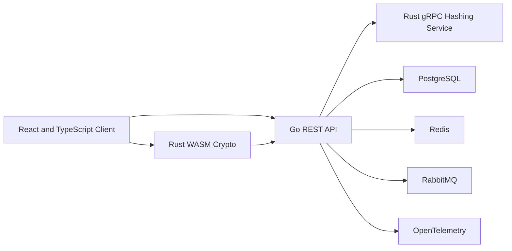

# VaultForge

VaultForge is a backend-first developer secrets vault built to demonstrate secure API design, authentication, PostgreSQL engineering, cross-language service integration, distributed systems, and browser-side cryptography.

The project is designed for an individual developer storing API keys, environment variables, database connection details, login records, and secure notes.

> VaultForge is a portfolio and learning project, not an audited password manager. Use synthetic data only.

## Architecture

VaultForge separates account authentication from vault encryption.

### Current backend

```text
Client
  ↓
Go REST API
  ├── Account registration and login
  ├── Ed25519 access tokens
  ├── Opaque refresh-token rotation
  ├── HttpOnly refresh cookies and CSRF protection
  ├── Stateful bearer authorization
  ├── Session listing and revocation
  ├── Owner-scoped vault workflows
  ├── Vault-item lifecycle and pagination
  ├── Optimistic concurrency and idempotency
  ├── Sanitized transactional outbox writes
  └── PostgreSQL persistence
```

### Planned platform



The React client is the next active roadmap phase. Redis, RabbitMQ publishing, OpenTelemetry, Rust services, and WebAssembly cryptography remain planned work. Vault and synthetic item workflows are implemented, but client-side vault encryption is not.

### Account authentication

The Go API receives the account password during registration and login. Password operations pass through a replaceable `PasswordHasher` interface.

The current development implementation uses a local Argon2id adapter. A later Rust gRPC service can replace it without changing the HTTP contracts or authentication service.

Successful login creates a server-side session family and returns:

- A short-lived Ed25519-signed access token in JSON
- Access-token and refresh-token expiration times in JSON
- A single-use opaque refresh token in a host-only `HttpOnly` cookie
- A readable CSRF cookie used with the `X-CSRF-Token` header

Login and refresh responses use `Cache-Control: no-store`. Refresh requests are bodyless, require the refresh cookie plus an exact CSRF cookie/header match, and rotate both cookies after success.

Refresh tokens are stored in PostgreSQL only as SHA-256 digests. Refresh rotation preserves the session family and detects replay.

Protected routes verify both the access-token signature and the active PostgreSQL session state. Revoking a session therefore invalidates already-issued access tokens immediately.

### Vault encryption

Vault encryption is a separate future browser-side workflow.

A Rust WebAssembly module will derive and manage vault encryption keys in the browser. The Go API must never receive the vault master passphrase, an unwrapped vault key, or decrypted vault contents.

## Current state

The current backend supports:

- Account registration and login
- Argon2id password hashing with random salts
- Ed25519 access-token issuance and verification
- Opaque refresh tokens stored only as SHA-256 digests
- Atomic refresh-token rotation
- Refresh-token replay detection and family revocation
- Host-only `HttpOnly`, `SameSite=Strict` refresh cookies
- Double-submit CSRF protection for refresh requests
- Refresh and CSRF cookie rotation and logout clearing
- Stateful bearer authentication backed by PostgreSQL
- Active-session listing and revocation
- Owner-scoped vault creation, listing, retrieval, renaming, and deletion
- Vault-item creation, listing, retrieval, update, soft deletion, restoration, and permanent deletion
- Item types for login records, API keys, environment variables, database connections, and secure notes
- Keyset pagination ordered by update time and item ID
- Idempotency-key protection for item creation
- Strong `ETag` and `If-Match` optimistic-concurrency protection
- Sanitized transactional outbox events written with vault and item mutations
- Generic credential, token, ownership, and not-found responses
- PostgreSQL persistence and migrations
- Database-backed readiness checks
- Strict JSON request handling and body limits
- Safe structured logging
- Unit, route, service, store, and real PostgreSQL integration tests

Item payloads currently contain synthetic dummy JSON only. They are visible to the Go API and PostgreSQL until the future browser-side encryption phase replaces them with encrypted envelopes.

The React client is the next active roadmap phase. Redis, RabbitMQ publishing, Rust services, WebAssembly cryptography, and production deployment remain later roadmap work.

## Technology

- **Backend:** Go, Chi, pgx, Zap
- **Database:** PostgreSQL
- **Authentication:** Argon2id through a replaceable hasher interface
- **Tokens:** Ed25519 JWT access tokens, opaque refresh tokens, and cookie-based refresh transport
- **Authorization:** Stateful bearer middleware with PostgreSQL session validation
- **Testing:** Go testing, race detector, real PostgreSQL integration tests
- **Quality:** gofmt, Vet, Staticcheck, Gitleaks
- **Planned:** Redis, RabbitMQ, OpenTelemetry, Rust gRPC, Rust WebAssembly, React, Docker, Kubernetes

## Repository structure

```text
vaultforge/
├── apps/
│   └── api/                 # Go HTTP API
├── deployments/
│   └── compose.yaml         # Local PostgreSQL
├── docs/
│   ├── architecture.md
│   ├── scope.md
│   └── threat-model.md
├── Makefile
├── README.md
├── SECURITY.md
└── .env.example
```

## Quick start

### Requirements

- Go
- Docker with Docker Compose
- Make
- Staticcheck
- golang-migrate
- direnv

### Configure the environment

```bash
cp .env.example .env
direnv allow
```

Generate a local Ed25519 seed:

```bash
openssl rand -base64 32
```

Place the generated value in:

```text
ACCESS_TOKEN_ED25519_SEED_BASE64
```

Only local synthetic values belong in `.env`. Never commit production credentials or signing keys.

### Start PostgreSQL and apply migrations

```bash
make db-setup
```

This prepares:

```text
vaultforge       development database
vaultforge_test  integration-test database
```

### Start the API

```bash
make dev
```

The API runs at:

```text
http://localhost:8080
```

## API routes

```text
GET    /health
GET    /health/live
GET    /health/ready

POST   /v1/auth/register
POST   /v1/auth/login
POST   /v1/auth/refresh

GET    /v1/sessions
DELETE /v1/sessions
DELETE /v1/sessions/current
DELETE /v1/sessions/{sessionID}

POST   /v1/vaults
GET    /v1/vaults
GET    /v1/vaults/{vaultID}
PATCH  /v1/vaults/{vaultID}
DELETE /v1/vaults/{vaultID}

POST   /v1/vaults/{vaultID}/items
GET    /v1/vaults/{vaultID}/items
GET    /v1/vaults/{vaultID}/items/{itemID}
PUT    /v1/vaults/{vaultID}/items/{itemID}
DELETE /v1/vaults/{vaultID}/items/{itemID}
POST   /v1/vaults/{vaultID}/items/{itemID}/restore
DELETE /v1/vaults/{vaultID}/items/{itemID}/permanent
```

All session, vault, and item routes require:

```text
Authorization: Bearer <access-token>
```

Item creation also requires `Idempotency-Key`. Item updates and lifecycle mutations require a strong quoted `If-Match` version.

See [`apps/api/README.md`](apps/api/README.md) for setup details, response contracts, security behavior, pagination, concurrency rules, and Thunder Client examples.

## Testing and quality

Run all tests with the race detector:

```bash
make test
```

Run the complete local verification suite:

```bash
make verify
```

The integration suite rebuilds the dedicated test database from migration version zero and tests real PostgreSQL behavior.

The current integration coverage includes:

- Registration and login
- Session creation
- Access-token verification
- Browser refresh-cookie issuance, CSRF validation, cookie rotation, and logout clearing
- Refresh-token rotation and replay detection
- Stateful authorization
- Session listing and revocation
- Cross-user ownership isolation
- Vault creation, retrieval, renaming, listing, and deletion
- Item creation, pagination, retrieval, update, soft deletion, restoration, and permanent deletion
- Idempotent create replay and idempotency conflicts
- Optimistic-concurrency conflicts
- Transactional outbox writes
- Regression checks preventing secret values from entering audit payloads
- Immediate invalidation of revoked access tokens

GitHub Actions runs formatting checks, module verification, Vet, Staticcheck, race-enabled tests, PostgreSQL integration tests, and Gitleaks.

## Security boundary

VaultForge must never log or expose outside the documented authentication transport:

- Plaintext passwords
- Encoded password hashes
- Authorization headers
- Cookies
- Access or refresh tokens
- Refresh-token digests
- Database URLs
- Token-signing seeds or private keys
- Vault passphrases
- Encryption keys
- Decrypted vault data

Account password hashing, session authentication, and future vault encryption are separate security concerns.

Access tokens are returned in JSON for in-memory client use. Refresh tokens are never returned in JSON; they are delivered through host-only `HttpOnly`, `SameSite=Strict` cookies scoped to `/v1/auth/refresh`. A readable CSRF cookie must exactly match the `X-CSRF-Token` header on refresh requests. Production enables the cookie `Secure` flag, while local development permits HTTP.

See:

- [`SECURITY.md`](SECURITY.md)
- [`docs/architecture.md`](docs/architecture.md)
- [`docs/threat-model.md`](docs/threat-model.md)
- [`docs/scope.md`](docs/scope.md)

## Disclaimer

VaultForge has not received an independent security audit and must not be used for real credentials or production secrets.
