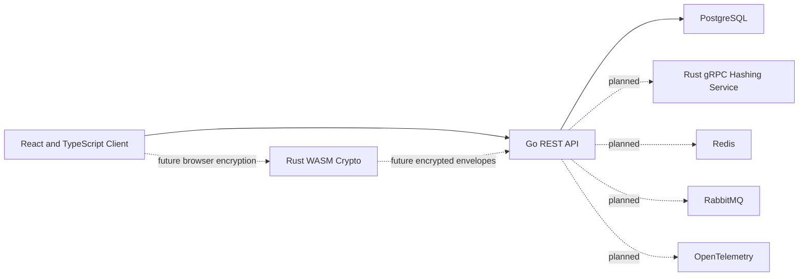

# VaultForge

VaultForge is a backend-first developer secrets vault built to demonstrate secure API design, authentication, PostgreSQL engineering, browser-safe session handling, frontend architecture, distributed systems, and future browser-side cryptography.

The project is designed for an individual developer storing API keys, environment variables, database connection details, login records, and secure notes.

> VaultForge is a portfolio and learning project, not an audited password manager. Use synthetic data only.

## Architecture

VaultForge separates account authentication from vault encryption.

### Current platform



The current React client exercises the complete user-facing authentication, session, vault, and item workflows through relative API URLs. Vite proxies `/v1` and `/health` to the Go API during development.

The current Go API provides:

- Account registration and login
- Ed25519 access tokens
- Opaque refresh-token rotation
- `HttpOnly` refresh cookies and CSRF protection
- Stateful bearer authorization
- Session listing and revocation
- Owner-scoped vault workflows
- Vault-item lifecycle and pagination
- Optimistic concurrency and idempotency
- Sanitized transactional outbox writes
- PostgreSQL persistence

Redis, RabbitMQ publishing, OpenTelemetry, Rust services, WebAssembly cryptography, and production deployment remain planned work.

### Account authentication

The Go API receives the account password during registration and login. Password operations pass through a replaceable `PasswordHasher` interface.

The current development implementation uses a local Argon2id adapter. A later Rust gRPC service can replace it without changing the HTTP contracts or authentication service.

Successful login creates a server-side session family and returns:

- A short-lived Ed25519-signed access token in JSON
- Access-token and refresh-token expiration times in JSON
- A single-use opaque refresh token in a host-only `HttpOnly` cookie
- A readable CSRF cookie used with the `X-CSRF-Token` header

The React client keeps the access token only in memory. A page reload removes that token from JavaScript memory, and the client restores authentication through the refresh cookie and CSRF token.

Login and refresh responses use `Cache-Control: no-store`. Refresh requests are bodyless, require the refresh cookie plus an exact CSRF cookie/header match, and rotate both cookies after success.

Refresh tokens are stored in PostgreSQL only as SHA-256 digests. Refresh rotation preserves the session family and detects replay.

Protected routes verify both the access-token signature and the active PostgreSQL session state. Revoking a session therefore invalidates already-issued access tokens immediately.

### Vault encryption

Vault encryption is a separate future browser-side workflow.

A Rust WebAssembly module will derive and manage vault encryption keys in the browser. The Go API must never receive the vault master passphrase, an unwrapped vault key, or decrypted vault contents.

Current item payloads contain synthetic dummy JSON. They are visible to the Go API and PostgreSQL until browser-side encryption replaces them with encrypted envelopes.

## Current state

### Backend

- Account registration and login
- Argon2id password hashing with random salts
- Ed25519 access-token issuance and verification
- Opaque refresh tokens stored only as SHA-256 digests
- Atomic refresh-token rotation
- Refresh-token replay detection and family revocation
- Host-only `HttpOnly`, `SameSite=Strict` refresh cookies
- Double-submit CSRF protection for refresh requests
- Refresh and CSRF cookie rotation and logout clearing
- Stateful bearer authentication backed by PostgreSQL
- Active-session listing and revocation
- Owner-scoped vault creation, listing, retrieval, renaming, and deletion
- Vault-item creation, listing, retrieval, update, soft deletion, restoration, and permanent deletion
- Item types for login records, API keys, environment variables, database connections, and secure notes
- Keyset pagination ordered by update time and item ID
- Idempotency-key protection for item creation
- Strong `ETag` and `If-Match` optimistic-concurrency protection
- Sanitized transactional outbox events written with vault and item mutations
- Generic credential, token, ownership, and not-found responses
- PostgreSQL persistence and migrations
- Database-backed readiness checks
- Strict JSON request handling and body limits
- Safe structured logging
- Unit, route, service, store, and real PostgreSQL integration tests

### Frontend

- React and TypeScript with Vite
- Declarative React Router routes
- Registration and login forms
- Protected-route and guest-route guards
- Automatic cookie-based session restoration
- In-memory access-token handling
- Typed API response parsing and validation
- Vault creation, listing, viewing, renaming, and deletion
- Item creation, listing, filtering, viewing, editing, deletion, restoration, and permanent deletion
- Login, API key, environment variable, database connection, and secure note forms
- Sensitive-value reveal and copy controls
- Strong-version conflict feedback with explicit reload
- Active-session listing, targeted revocation, current-device logout, and logout-all
- Loading, empty, retryable error, not-found, and unauthorized states
- Responsive phone, tablet, and desktop layouts
- Vitest and React Testing Library coverage
- Real-stack Playwright coverage across React, Go, and PostgreSQL
- Automated axe accessibility scans

## Technology

- **Frontend:** React, TypeScript, Vite, React Router
- **Backend:** Go, Chi, pgx, Zap
- **Database:** PostgreSQL
- **Authentication:** Argon2id through a replaceable hasher interface
- **Tokens:** Ed25519 JWT access tokens, opaque refresh tokens, and cookie-based refresh transport
- **Authorization:** Stateful bearer middleware with PostgreSQL session validation
- **Frontend testing:** Vitest, React Testing Library, Playwright, axe
- **Backend testing:** Go testing, race detector, real PostgreSQL integration tests
- **Quality:** Prettier, ESLint, TypeScript, gofmt, Vet, Staticcheck, Gitleaks
- **Planned:** Redis, RabbitMQ, OpenTelemetry, Rust gRPC, Rust WebAssembly, Docker application images, Kubernetes

## Repository structure

```text
vaultforge/
├── apps/
│   ├── api/                 # Go HTTP API
│   └── web/                 # React and TypeScript client
├── deployments/
│   └── compose.yaml         # Local PostgreSQL
├── docs/
│   ├── architecture.md
│   ├── scope.md
│   └── threat-model.md
├── Makefile
├── README.md
├── SECURITY.md
└── .env.example
```

## Quick start

### Requirements

- Go
- Node.js 22 or newer
- npm 10.9 or newer
- Docker with Docker Compose
- Make
- Staticcheck
- golang-migrate
- direnv
- Chromium installed through Playwright for browser tests

### Configure the environment

```bash
cp .env.example .env
direnv allow
```

Generate a local Ed25519 seed:

```bash
openssl rand -base64 32
```

Place the generated value in:

```text
ACCESS_TOKEN_ED25519_SEED_BASE64
```

Only local synthetic values belong in `.env`. Never commit production credentials or signing keys.

### Install dependencies

```bash
make setup
```

This downloads Go modules, installs frontend packages, and installs the Playwright Chromium browser.

### Start PostgreSQL and apply migrations

```bash
make db-setup
```

This prepares:

```text
vaultforge       development database
vaultforge_test  integration-test database
```

The E2E workflow creates and resets a separate `vaultforge_e2e` database when needed.

### Start the application

In one terminal:

```bash
make dev-api
```

The API runs at:

```text
http://localhost:8080
```

In a second terminal:

```bash
make dev-web
```

The frontend runs at the Vite development URL, normally:

```text
http://localhost:5173
```

During development, Vite proxies `/v1` and `/health` to the Go API. The browser client uses relative API URLs.

## Browser routes

```text
/register
/login
/vaults
/vaults/{vaultID}
/vaults/{vaultID}/items/{itemID}
/sessions
```

Authenticated users are redirected away from `/login` and `/register`. Signed-out users who request protected routes are sent to Login and returned to their original internal path after successful authentication.

## API routes

```text
GET    /health
GET    /health/live
GET    /health/ready

POST   /v1/auth/register
POST   /v1/auth/login
POST   /v1/auth/refresh

GET    /v1/sessions
DELETE /v1/sessions
DELETE /v1/sessions/current
DELETE /v1/sessions/{sessionID}

POST   /v1/vaults
GET    /v1/vaults
GET    /v1/vaults/{vaultID}
PATCH  /v1/vaults/{vaultID}
DELETE /v1/vaults/{vaultID}

POST   /v1/vaults/{vaultID}/items
GET    /v1/vaults/{vaultID}/items
GET    /v1/vaults/{vaultID}/items/{itemID}
PUT    /v1/vaults/{vaultID}/items/{itemID}
DELETE /v1/vaults/{vaultID}/items/{itemID}
POST   /v1/vaults/{vaultID}/items/{itemID}/restore
DELETE /v1/vaults/{vaultID}/items/{itemID}/permanent
```

All session, vault, and item routes require:

```text
Authorization: Bearer <access-token>
```

Item creation also requires `Idempotency-Key`. Item updates and lifecycle mutations require a strong quoted `If-Match` version.

See [`apps/api/README.md`](apps/api/README.md) for response contracts, security behavior, pagination, concurrency rules, migrations, and Thunder Client examples.

See [`apps/web/README.md`](apps/web/README.md) for frontend architecture, browser-session behavior, commands, and E2E details.

## Testing and quality

Run backend and frontend unit, component, and integration tests:

```bash
make test
```

Run the real-stack browser test:

```bash
make test-e2e
```

Run the complete local verification suite:

```bash
make verify
```

`make verify` runs:

- Go formatting checks
- Go module verification
- Vet
- Staticcheck
- Race-enabled Go tests
- Frontend formatting checks
- ESLint
- TypeScript compilation
- Vitest unit and component tests
- Production frontend build
- E2E database reset and migrations
- The Playwright real-stack workflow

The real-stack Playwright workflow verifies:

- Registration and login
- In-memory access-token handling
- Refresh-cookie authentication restoration after reload
- Vault creation
- Item creation and editing
- A real stale-version conflict between two browser sessions
- Delete, restore, and permanent deletion
- Session listing
- Current-session logout
- Protected-route rejection after logout
- Accessibility checks
- Phone, tablet, and desktop overflow checks

GitHub Actions runs four jobs:

- Go checks
- Web checks
- Browser E2E
- Secret scan

## Security boundary

VaultForge must never log or expose outside the documented authentication transport:

- Plaintext passwords
- Encoded password hashes
- Authorization headers
- Cookies
- Access or refresh tokens
- Refresh-token digests
- Database URLs
- Token-signing seeds or private keys
- Vault passphrases
- Encryption keys
- Decrypted vault data

The browser must never persist access tokens in:

- `localStorage`
- `sessionStorage`
- IndexedDB
- URLs
- Logs
- Error reports

Account password hashing, session authentication, and future vault encryption are separate security concerns.

Access tokens are returned in JSON for in-memory client use. Refresh tokens are never returned in JSON; they are delivered through host-only `HttpOnly`, `SameSite=Strict` cookies scoped to `/v1/auth/refresh`. A readable CSRF cookie must exactly match the `X-CSRF-Token` header on refresh requests. Production enables the cookie `Secure` flag, while local development and tests permit HTTP.

See:

- [`SECURITY.md`](SECURITY.md)
- [`docs/architecture.md`](docs/architecture.md)
- [`docs/threat-model.md`](docs/threat-model.md)
- [`docs/scope.md`](docs/scope.md)

## Disclaimer

VaultForge has not received an independent security audit and must not be used for real credentials or production secrets.
