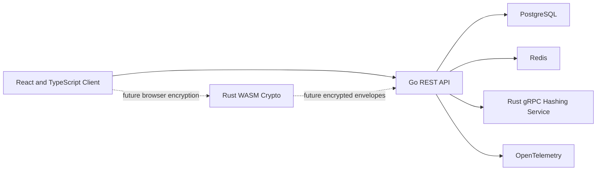

# VaultForge

VaultForge is a backend-first developer secrets vault built to demonstrate secure API design, authentication, PostgreSQL engineering, browser-safe session handling, frontend architecture, distributed systems, and future browser-side cryptography.

The project is designed for an individual developer storing API keys, environment variables, database connection details, login records, and secure notes.

> VaultForge is a portfolio and learning project, not an audited password manager. Use synthetic data only.

## Architecture

VaultForge separates account authentication from vault encryption.

### Current platform



The current React client exercises the complete user-facing authentication, session, vault, and item workflows through relative API URLs. Vite proxies `/v1` and `/health` to the Go API during development.

Sensitive values are masked by default and automatically re-mask 15 seconds after being revealed. Copying provides temporary check-icon feedback, a visible confirmation message, and an accessible status announcement. When browser support allows it, VaultForge attempts to clear copied values after 30 seconds without overwriting newer clipboard contents. Revealed values are also hidden after five minutes of inactivity or when the browser tab becomes hidden. These are privacy safeguards only and do not cryptographically lock or encrypt the vault.

The current Go API provides:

- Account registration and login
- Ed25519 access tokens
- Opaque refresh-token rotation
- `HttpOnly` refresh cookies and CSRF protection
- Stateful bearer authorization
- Session listing and revocation
- Owner-scoped vault workflows
- Vault-item lifecycle and pagination
- Optimistic concurrency and PostgreSQL-backed idempotency
- Sanitized transactional outbox writes
- PostgreSQL persistence
- Redis-backed distributed request limits
- Failed-login tracking and temporary lockouts
- Bounded dependency and HTTP timeouts
- PostgreSQL and Redis readiness checks
- Sanitized build diagnostics
- Loopback-only low-cardinality HTTP metrics

Minimal OpenTelemetry tracing is implemented for HTTP, PostgreSQL, and Redis through a local Collector and Jaeger. The reduced frontend security, privacy, accessibility, and usability finishing pass is complete. The Rust gRPC password hashing service is implemented. Rust WebAssembly browser encryption, ciphertext-only persistence, application container images, Kubernetes, and production deployment remain planned work.

### Account authentication

The Go API receives the account password during registration and login. Password operations pass through a replaceable `PasswordHasher` interface.

The Go API now uses the Rust gRPC hash service for account-password hashing and verification. The service lives under `services/hash-service` and exposes `HashPassword` and `VerifyPassword` through the shared protobuf contract in `packages/proto`.

Successful login creates a server-side session family and returns:

- A short-lived Ed25519-signed access token in JSON
- Access-token and refresh-token expiration times in JSON
- A single-use opaque refresh token in a host-only `HttpOnly` cookie
- A readable CSRF cookie used with the `X-CSRF-Token` header

The React client keeps the access token only in memory. A page reload removes that token from JavaScript memory, and the client restores authentication through the refresh cookie and CSRF token.

Login and refresh responses use `Cache-Control: no-store`. Refresh requests are bodyless, require the refresh cookie plus an exact CSRF cookie/header match, and rotate both cookies after success.

Refresh tokens are stored in PostgreSQL only as SHA-256 digests. Refresh rotation preserves the session family and detects replay.

Protected routes verify both the access-token signature and the active PostgreSQL session state. Revoking a session therefore invalidates already-issued access tokens immediately.

### Vault encryption

Vault encryption is a separate future browser-side workflow.

A Rust WebAssembly module will derive and manage vault encryption keys in the browser. The Go API must never receive the vault master passphrase, an unwrapped vault key, or decrypted vault contents.

Current item payloads contain synthetic dummy JSON. They are visible to the Go API and PostgreSQL until browser-side encryption replaces them with encrypted envelopes.

## Current state

### Backend

- Account registration and login
- Argon2id password hashing with random salts
- Ed25519 access-token issuance and verification
- Opaque refresh tokens stored only as SHA-256 digests
- Atomic refresh-token rotation
- Refresh-token replay detection and family revocation
- Host-only `HttpOnly`, `SameSite=Strict` refresh cookies
- Double-submit CSRF protection for refresh requests
- Refresh and CSRF cookie rotation and logout clearing
- Stateful bearer authentication backed by PostgreSQL
- Active-session listing and revocation
- Owner-scoped vault creation, listing, retrieval, renaming, and deletion
- Vault-item creation, listing, retrieval, update, soft deletion, restoration, and permanent deletion
- Item types for login records, API keys, environment variables, database connections, and secure notes
- Keyset pagination ordered by update time and item ID
- PostgreSQL-backed idempotency-key protection for item creation
- Strong `ETag` and `If-Match` optimistic-concurrency protection
- Sanitized transactional audit intent records written in the same PostgreSQL transaction as vault and item mutations
- Distributed Redis limits for registration, login, refresh, and authenticated mutations
- Failed-login counters and temporary lockouts keyed through HMAC-protected identities
- PostgreSQL and Redis startup checks and composite readiness
- Rust gRPC Argon2id hash service with PHC hash generation, password verification, health checks, reflection, safe validation, and Rust tests
- Defined PostgreSQL and Redis outage behavior with safe `503` responses
- Configurable HTTP, shutdown, PostgreSQL, and Redis timeouts
- Context cancellation through handlers, services, and repositories
- Aggregate header, request-body, query, token, cursor, and identifier bounds
- Bounded and sanitized request IDs
- Sanitized build version and commit diagnostics
- Loopback-only Prometheus-text HTTP metrics using normalized route patterns
- Optional OpenTelemetry traces for normalized HTTP routes, PostgreSQL operations, and Redis operations
- Trace IDs correlated with safe structured request logs
- Generic credential, token, ownership, dependency, and not-found responses
- Safe structured logging
- Unit, route, service, store, PostgreSQL integration, Redis integration, outage, and race tests

### Frontend

- React and TypeScript with Vite
- Declarative React Router routes
- Registration and login forms
- Protected-route and guest-route guards
- Automatic cookie-based session restoration
- In-memory access-token handling
- Typed API response parsing and validation
- Vault creation, listing, viewing, renaming, and deletion
- Item creation, listing, filtering, viewing, editing, deletion, restoration, and permanent deletion
- Login, API key, environment variable, database connection, and secure note forms
- Sensitive-value reveal and copy controls
- Strong-version conflict feedback with explicit reload
- Active-session listing, targeted revocation, current-device logout, and logout-all
- Loading, empty, retryable error, not-found, and unauthorized states
- Responsive phone, tablet, and desktop layouts
- Vitest and React Testing Library coverage
- Real-stack Playwright coverage across React, Go, PostgreSQL, and Redis
- Automated axe accessibility scans

## Technology

- **Frontend:** React, TypeScript, Vite, React Router
- **Backend:** Go, Chi, pgx, go-redis, Zap
- **Persistence:** PostgreSQL
- **Operational state:** Redis
- **Authentication:** Argon2id through a replaceable hasher interface
- **Tokens:** Ed25519 JWT access tokens, opaque refresh tokens, and cookie-based refresh transport
- **Authorization:** Stateful bearer middleware with PostgreSQL session validation
- **Frontend testing:** Vitest, React Testing Library, Playwright, axe
- **Backend testing:** Go testing, race detector, real PostgreSQL and Redis integration tests
- **Rust:** Tonic gRPC Argon2id hashing service
- **Quality:** Prettier, ESLint, TypeScript, gofmt, Vet, Staticcheck, Gitleaks
- **Observability:** OpenTelemetry, OpenTelemetry Collector, Jaeger, safe structured logs, low-cardinality metrics
- **Planned:** Rust WebAssembly, browser-side encryption, Kubernetes, optional RabbitMQ workflows

## Repository structure

```text
vaultforge/
├── apps/
│   ├── api/                 # Go HTTP API
│   └── web/                 # React and TypeScript client
├── deployments/
│   ├── compose.yaml         # Local PostgreSQL, Redis, Collector, and Jaeger
│   └── otel-collector.yaml  # Local trace pipeline
├── docs/
│   ├── architecture.md
│   ├── runbook.md
│   ├── scope.md
│   ├── testing.md
│   └── threat-model.md
├── Makefile
├── README.md
├── SECURITY.md
└── .env.example
```

## Quick start

### Requirements

- Go
- Node.js 22 or newer
- npm 10.9 or newer
- Docker with Docker Compose
- Make
- Staticcheck
- golang-migrate
- direnv
- Chromium installed through Playwright for browser tests

### Configure the environment

```bash
cp .env.example .env
direnv allow
```

Generate a local Ed25519 signing seed:

```bash
openssl rand -base64 32
```

Place the generated value in:

```text
ACCESS_TOKEN_ED25519_SEED_BASE64
```

Generate a separate HMAC key for Redis identity protection:

```bash
openssl rand -base64 32
```

Place that different generated value in:

```text
RATE_LIMIT_IDENTITY_HMAC_KEY_BASE64
```

Do not reuse one key for both purposes. Only local synthetic values belong in `.env`. Never commit credentials, signing seeds, HMAC keys, or real secrets.

### Install dependencies

```bash
make setup
```

This downloads Go modules, installs frontend packages, and installs the Playwright Chromium browser.

### Start PostgreSQL and Redis, then apply migrations

```bash
make db-setup
```

This starts the local PostgreSQL and Redis containers and prepares:

```text
vaultforge       development database
vaultforge_test  integration-test database
```

Redis uses a local, non-persistent development instance. The E2E workflow creates and resets a separate `vaultforge_e2e` database and uses an isolated Redis database number.

### Start the application

In one terminal:

```bash
make dev-api
```

The API runs at:

```text
http://localhost:8080
```

In a second terminal:

```bash
make dev-web
```

The frontend runs at the Vite development URL, normally:

```text
http://localhost:5173
```

During development, Vite proxies `/v1` and `/health` to the Go API. The browser client uses relative API URLs.

## Optional local tracing

Tracing is disabled by default and is not required for normal development.

Start the OpenTelemetry Collector and Jaeger:

```bash
make observability-up
```

Run the API with tracing enabled:

```bash
OTEL_TRACING_ENABLED=true \
OTEL_EXPORTER_OTLP_ENDPOINT=http://127.0.0.1:4318 \
make dev-api
```

Generate a request and open Jaeger at:

```text
http://localhost:16686
```

VaultForge exports normalized HTTP spans plus PostgreSQL and Redis operation
spans. It does not export raw paths, query strings, SQL statements, SQL
parameters, Redis commands, Redis keys, request bodies, tokens, cookies, or
vault payloads.

See [`docs/runbook.md`](docs/runbook.md) for startup, troubleshooting, and safe
operational-data rules.

## Browser routes

```text
/register
/login
/vaults
/vaults/{vaultID}
/vaults/{vaultID}/items/{itemID}
/sessions
```

Authenticated users are redirected away from `/login` and `/register`. Signed-out users who request protected routes are sent to Login and returned to their original internal path after successful authentication.

## API routes

```text
GET    /health
GET    /health/live
GET    /health/ready
GET    /health/diagnostics
GET    /internal/metrics

POST   /v1/auth/register
POST   /v1/auth/login
POST   /v1/auth/refresh

GET    /v1/sessions
DELETE /v1/sessions
DELETE /v1/sessions/current
DELETE /v1/sessions/{sessionID}

POST   /v1/vaults
GET    /v1/vaults
GET    /v1/vaults/{vaultID}
PATCH  /v1/vaults/{vaultID}
DELETE /v1/vaults/{vaultID}

POST   /v1/vaults/{vaultID}/items
GET    /v1/vaults/{vaultID}/items
GET    /v1/vaults/{vaultID}/items/{itemID}
PUT    /v1/vaults/{vaultID}/items/{itemID}
DELETE /v1/vaults/{vaultID}/items/{itemID}
POST   /v1/vaults/{vaultID}/items/{itemID}/restore
DELETE /v1/vaults/{vaultID}/items/{itemID}/permanent
```

`/health/diagnostics` returns only the sanitized service name, build version, and commit. `/internal/metrics` is available only to the direct loopback peer and ignores forwarded-IP headers.

All session, vault, and item routes require:

```text
Authorization: Bearer <access-token>
```

Item creation also requires `Idempotency-Key`. Item updates and lifecycle mutations require a strong quoted `If-Match` version.

See [`apps/api/README.md`](apps/api/README.md) for response contracts, security behavior, Redis policies, failure behavior, pagination, concurrency rules, migrations, and Thunder Client examples.

See [`apps/web/README.md`](apps/web/README.md) for frontend architecture, browser-session behavior, commands, and E2E details.

## Reliability and failure behavior

Redis stores only bounded, short-lived operational security state:

- Fixed-window request counters
- Failed-login counters
- Temporary login-lockout state

Redis identities are transformed with HMAC-SHA-256 before becoming key material. Redis never stores passwords, password hashes, raw tokens, authorization headers, cookies, signing keys, item payloads, vault values, encryption keys, database URLs, or raw dependency errors.

The default policies are:

- Registration: 5 requests per 10 minutes per direct peer IP
- Login: 20 requests per minute per direct peer IP
- Refresh: 30 requests per minute per direct peer IP
- Authenticated mutations: 60 requests per minute per authenticated user
- Login lockout: 5 invalid-credential failures within 15 minutes triggers a 15-minute lockout for normalized email plus direct peer IP

Forwarded client-IP headers are ignored until an explicit trusted-proxy model exists.

Failure behavior is intentional:

- Startup fails when PostgreSQL or Redis is unavailable.
- Liveness remains dependency-free.
- Readiness checks PostgreSQL and Redis with a short timeout.
- PostgreSQL failure causes data-dependent requests to return safe `503` responses.
- Redis failure blocks registration, login, refresh, and authenticated mutations with safe `503` responses.
- Read-only vault and item requests do not depend on Redis during request handling.
- Registration and login fail closed if password hashing is unavailable.
- Dependency errors never expose connection strings or raw driver details.

PostgreSQL remains the source of truth for durable item-creation idempotency. Redis does not duplicate that mechanism.

## Testing and quality

Run backend and frontend unit, component, and integration tests:

```bash
make test
```

Run the real-stack browser test:

```bash
make test-e2e
```

Build the API with sanitized Git version and commit metadata:

```bash
make build-api
```

Run the complete local verification suite:

```bash
make verify
```

The maintained API contract is [`apps/api/openapi.yaml`](apps/api/openapi.yaml).
The Go test suite validates the document, checks it against the registered Chi
routes, and validates representative requests and responses. Focused fuzz tests
cover item cursors, strong item versions, and bearer-token parsing.

The Playwright real-stack workflow is the official VaultForge system smoke test.
It exercises the React client, Go API, PostgreSQL, and Redis through the complete
account, vault, item, conflict, deletion, restoration, session, and logout
workflow.

See [`docs/testing.md`](docs/testing.md) for test ownership, security rules,
optional fuzzing commands, and the complete QA strategy.

`make verify` runs:

- Go formatting checks
- Go module verification
- Vet
- Staticcheck
- Race-enabled Go tests
- PostgreSQL and Redis integration tests
- API build with linker-injected version and commit metadata
- Frontend formatting checks
- ESLint
- TypeScript compilation
- Vitest unit and component tests
- Production frontend build
- E2E database reset and migrations
- The Playwright real-stack workflow

The real-stack Playwright workflow verifies:

- Registration and login
- In-memory access-token handling
- Refresh-cookie authentication restoration after reload
- Redis-backed authentication and mutation enforcement in the normal path
- Vault creation
- Item creation and editing
- A real stale-version conflict between two browser sessions
- Delete, restore, and permanent deletion
- Session listing
- Current-session logout
- Protected-route rejection after logout
- Accessibility checks
- Phone, tablet, and desktop overflow checks

Focused backend tests also verify:

- Atomic Redis limits under concurrency
- Login-lockout activation, expiration, and clearing
- Redis keys and values contain no raw identity material
- PostgreSQL and Redis outage behavior and recovery
- Request deadlines and cancellation propagation
- Bounded headers, bodies, queries, tokens, cursors, and identifiers
- Diagnostics, metrics, and traces never expose secrets or raw resource identifiers
- OpenTelemetry spans use normalized routes and sanitized dependency operation names
- Request logs correlate safe request IDs with trace IDs

GitHub Actions runs four jobs:

- Go checks
- Web checks
- Browser E2E
- Secret scan

## Security boundary

VaultForge must never log, meter, cache, or expose outside the documented authentication transport:

- Plaintext passwords
- Encoded password hashes
- Authorization headers
- Cookies
- Access or refresh tokens
- Refresh-token digests
- Database or Redis URLs
- Token-signing seeds or private keys
- Rate-limit identity HMAC keys
- Raw email or IP identities in Redis keys
- Vault passphrases
- Encryption keys
- Vault payloads or decrypted vault data
- Raw dependency error strings
- Raw URLs, query strings, SQL statements, SQL parameters, Redis commands, Redis keys, or Redis values in telemetry
- Raw resource identifiers in trace names or attributes

The browser must never persist access tokens in:

- `localStorage`
- `sessionStorage`
- IndexedDB
- URLs
- Logs
- Error reports

Account password hashing, session authentication, Redis operational security state, and future vault encryption are separate security concerns.

Access tokens are returned in JSON for in-memory client use. Refresh tokens are never returned in JSON; they are delivered through host-only `HttpOnly`, `SameSite=Strict` cookies scoped to `/v1/auth/refresh`. A readable CSRF cookie must exactly match the `X-CSRF-Token` header on refresh requests. Production enables the cookie `Secure` flag, while local development and tests permit HTTP.

Metrics use normalized route patterns, HTTP methods, and status classes only. The internal metrics route rejects non-loopback direct peers and does not trust forwarded-IP headers.

See:

- [`SECURITY.md`](SECURITY.md)
- [`docs/architecture.md`](docs/architecture.md)
- [`docs/runbook.md`](docs/runbook.md)
- [`docs/threat-model.md`](docs/threat-model.md)
- [`docs/scope.md`](docs/scope.md)

## Disclaimer

VaultForge has not received an independent security audit and must not be used for real credentials or production secrets.
