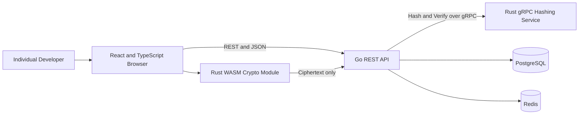

# VaultForge Architecture

## Target architecture

## Responsibility boundaries

### Browser

- Collects the account password during authentication.
- Collects the separate vault master passphrase during vault unlock.
- Derives and unwraps vault encryption keys through Rust WebAssembly.
- Encrypts vault items before upload.
- Decrypts vault items after download.
- Keeps unwrapped encryption keys only in memory.
- Clears references to unwrapped keys when the vault locks.

### Go API

- Exposes the HTTP and JSON API.
- Handles users, sessions, authorization, and vault metadata.
- Stores opaque encrypted envelopes.
- Calls the Rust hashing service for account-password hashing and verification.
- Cannot decrypt vault contents.
- Must not log request bodies, passwords, tokens, or vault payloads.

### Rust hashing service

- Hashes and verifies account passwords using Argon2id.
- Exposes a versioned gRPC contract.
- Has no application database.
- Has no access to vault records.
- Retains no plaintext password after a request completes.
- Must fail safely on malformed or oversized input.

### PostgreSQL

- Stores account records and password hashes.
- Stores only hashed refresh tokens.
- Stores vault metadata.
- Stores versioned encrypted envelopes.
- Cannot decrypt vault contents.

### Redis

- Stores rate-limit counters.
- Stores short-lived failed-login and lockout state.
- May later store bounded idempotency metadata.
- Never stores passwords, raw tokens, encryption keys, or vault contents.

## Authentication flow

1. The browser sends an account email and password to the Go API over a secure
   connection.
2. The Go API calls the Rust hashing service through the PasswordHasher
   interface.
3. The Rust service hashes or verifies the password using Argon2id.
4. The Go API creates or validates the user session.
5. The account password is not used to encrypt the vault.

## Vault unlock and encryption flow

1. The browser downloads the vault salt and wrapped vault key.
2. The user enters a vault master passphrase in the browser.
3. Rust WebAssembly derives a key-encryption key from the passphrase.
4. The derived key unwraps the random vault data-encryption key.
5. The unwrapped vault key remains in browser memory.
6. The browser encrypts vault items before sending them to the Go API.
7. The Go API stores only encrypted payloads and non-secret metadata.
8. The browser decrypts downloaded items only after the vault is unlocked.

## Why account authentication and vault encryption are separate

The account password proves the user's identity to the server.

The vault master passphrase unlocks client-side encrypted data.

Keeping them separate means:

- The server can authenticate a user without learning the vault key.
- Changing an account password does not require re-encrypting vault items.
- Changing a vault passphrase can re-wrap the vault key without changing
  account authentication.
- The Rust hashing service has no reason to access encrypted vault data.
- A database dump does not contain plaintext vault items.

## Planned repository boundaries

- apps/api: Go HTTP API
- apps/web: React and TypeScript browser client
- services/hash-service: Rust gRPC Argon2id service
- packages/proto: shared Protocol Buffer contracts
- deployments: Docker Compose and later deployment configuration
- docs: architecture, threat model, decisions, and operational documentation
- scripts: setup, generation, migration, and smoke-test scripts

## Current sprint boundary

Steps 0 and 1 contain:

- Product scope
- Threat model
- Target architecture
- Repository scaffolding
- Local development commands
- Go and frontend compilation baselines
- Continuous integration
- Secret scanning

The following are planned but not implemented during Steps 0 and 1:

- HTTP routing
- Authentication
- PostgreSQL schema
- Redis integration
- Rust gRPC hashing
- WebAssembly cryptography
- Vault endpoints
- Docker Compose services
- RabbitMQ
- Kubernetes
- Full distributed tracing
