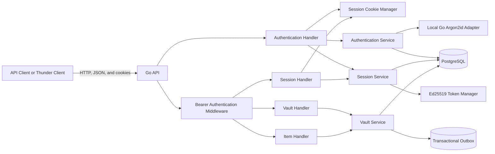
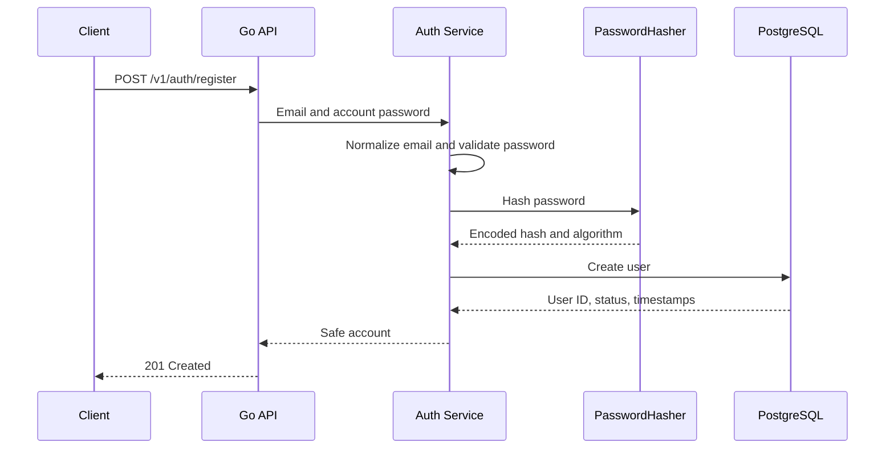
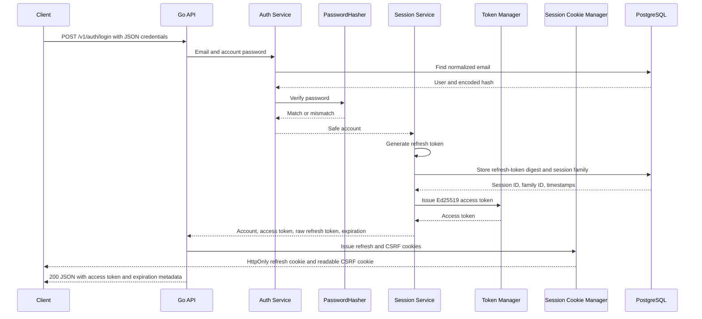
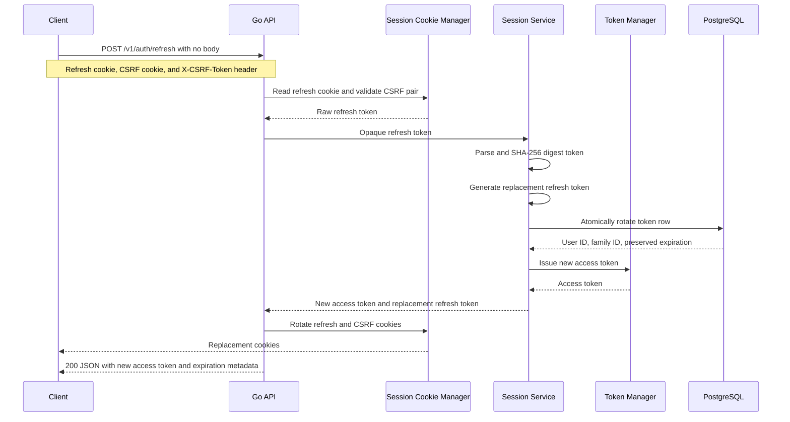
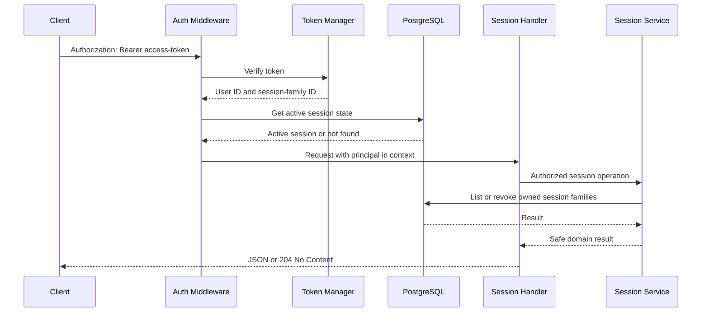
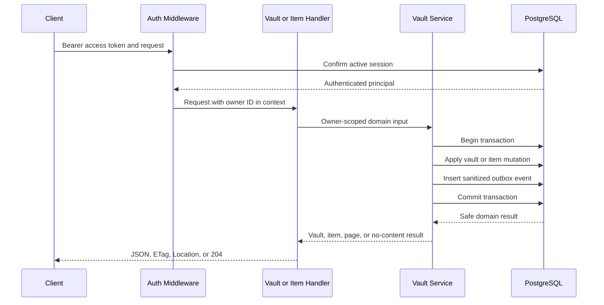
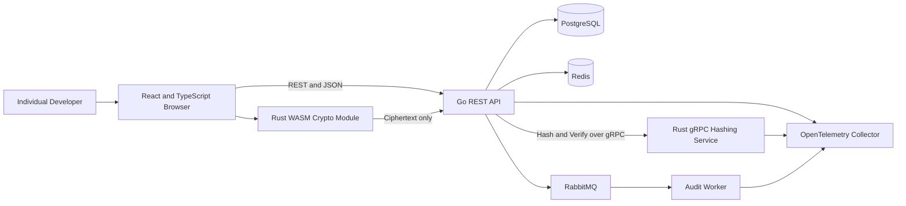

# VaultForge Architecture

## Overview

VaultForge is a backend-first developer secrets vault.

Its architecture intentionally separates:

1. Account authentication
2. Session authentication and authorization
3. Vault unlocking and encryption
4. Persistence
5. Reliability and asynchronous processing
6. Observability

The project is being built incrementally. Components marked as planned are part of the target architecture but are not currently running.

## Current architecture



## Current request flow

### Public authentication requests

Registration and login:

```text
HTTP JSON request
    ↓
Chi router
    ↓
Request ID, safe logging, recovery, security headers, timeout
    ↓
Strict JSON decoder and body limit
    ↓
Authentication handler
    ↓
Authentication or session service
    ├── PasswordHasher
    ├── AccessTokenProvider
    ├── RefreshTokenProvider
    ├── UserStore
    └── SessionStore
          ↓
      PostgreSQL
```

Login returns the access token and expiration metadata in JSON. It delivers the refresh token through an `HttpOnly` cookie and a separate readable CSRF cookie.

Refresh:

```text
Bodyless HTTP request
    ├── HttpOnly refresh cookie
    ├── Readable CSRF cookie
    └── X-CSRF-Token header
          ↓
      Session cookie manager
          ├── Require exactly one refresh cookie
          ├── Require exactly one CSRF cookie and header
          └── Compare CSRF values
                ↓
            Session service
                ├── Rotate the refresh-token digest
                ├── Preserve absolute family expiration
                └── Issue a new access token
                      ↓
                  Rotate both browser cookies
```

### Protected session, vault, and item requests

```text
HTTP request
    ↓
Chi router
    ↓
Request ID, safe logging, recovery, security headers, timeout
    ↓
Bearer authentication middleware
    ├── Parse exactly one Authorization header
    ├── Verify Ed25519 access-token signature and claims
    ├── Confirm active session state in PostgreSQL
    └── Store the authenticated principal in request context
    ↓
Session, vault, or item handler
    ↓
Domain service
    ├── Validate input and state transitions
    ├── Enforce ownership using the authenticated user ID
    ├── Enforce idempotency or expected version where required
    └── Map internal failures to safe public errors
    ↓
PostgreSQL transaction
    ├── Domain mutation
    └── Sanitized transactional outbox event
```

## Current responsibilities

### Go API

- Exposes JSON HTTP routes.
- Handles request validation and public error mapping.
- Coordinates registration, login, refresh, authorization, and session management.
- Creates, lists, retrieves, renames, and deletes owner-scoped vaults.
- Creates, lists, retrieves, updates, soft-deletes, restores, and permanently deletes owner-scoped items.
- Supports opaque keyset pagination for item collections.
- Enforces idempotency keys for item creation.
- Enforces strong `ETag` and `If-Match` optimistic concurrency.
- Writes sanitized audit events through a transactional outbox.
- Normalizes account emails.
- Applies account-password policy.
- Calls the replaceable password hasher.
- Issues and verifies Ed25519 access tokens.
- Generates and rotates opaque refresh tokens.
- Delivers refresh tokens through host-only `HttpOnly`, `SameSite=Strict` cookies.
- Enforces double-submit CSRF protection for bodyless refresh requests.
- Rotates and clears browser session cookies.
- Enforces active-session checks for protected requests.
- Exposes liveness and database-backed readiness routes.
- Logs safe request metadata only.
- Accepts only synthetic item payloads until browser-side encryption is implemented.

### Local Argon2id adapter

- Implements the `PasswordHasher` interface.
- Normalizes account passwords using Unicode NFC.
- Generates a fresh random salt for each hash.
- Produces a PHC-style Argon2id encoded value.
- Verifies passwords using encoded parameters.
- Uses constant-time hash comparison.
- Rejects malformed hashes and unsafe parameter values.
- Retains no password after the operation completes.

The local adapter is temporary. It exists so the authentication contract can be completed before the Rust service is built.

### Access-token manager

- Signs access tokens with Ed25519.
- Includes the user ID as the JWT subject.
- Includes the session-family ID in the `sid` claim.
- Validates algorithm, key ID, issuer, audience, issued-at, not-before, and expiration.
- Rejects malformed, expired, incorrectly signed, or incorrectly configured tokens.
- Never stores access tokens in PostgreSQL.
- Redacts token and manager values when formatted.

### Session cookie manager

- Issues the host-only refresh cookie with `HttpOnly`, `SameSite=Strict`, and `Path=/v1/auth/refresh`.
- Issues a separate readable CSRF cookie with `SameSite=Strict` and `Path=/`.
- Enables the `Secure` flag in production and permits local HTTP in development and test.
- Requires exactly one refresh cookie, CSRF cookie, and `X-CSRF-Token` header.
- Parses and compares CSRF values without exposing them through formatting.
- Rotates both cookies after successful refresh.
- Clears both cookies after current-session logout, current-session revocation, logout-all, or invalid refresh credentials.

### Session service

- Creates one session family per successful login.
- Generates opaque refresh tokens.
- Stores only refresh-token SHA-256 digests.
- Rotates refresh tokens atomically.
- Preserves token-family identity and absolute refresh expiration.
- Revokes the entire token family when rotated-token replay is detected.
- Validates access tokens against active PostgreSQL session state.
- Lists active session families for the authenticated user.
- Revokes the current session, one owned session, or all user sessions.
- Fails closed when post-commit access-token issuance fails.

### PostgreSQL

Currently stores:

- Users
- Encoded account-password hashes
- Password algorithm identifiers
- Session rows
- Refresh-token SHA-256 digests
- Token-family identifiers
- Session expiration and revocation timestamps
- Session user-agent metadata
- Owner-scoped vault metadata
- Synthetic generic item payloads during the current backend phase
- Item versions, timestamps, and deletion state
- Sanitized transactional outbox records

PostgreSQL never stores plaintext account passwords, raw refresh tokens, access tokens, vault passphrases, unwrapped encryption keys, or real vault secrets.

The current synthetic item payload is intentionally temporary. A future browser-side encryption phase will replace it with an opaque encrypted envelope.

## Current account registration flow



The store receives only the encoded hash and algorithm identifier. It never receives the plaintext password.

## Current account login flow



Unknown emails, incorrect passwords, invalid login input, and disabled accounts produce the same public credentials error.

Unknown accounts also consume password-hashing work to reduce obvious timing differences.

If access-token issuance fails after session creation, the newly created token family is revoked.

Login responses use `Cache-Control: no-store`. The refresh token is never included in the JSON response.

## Current refresh flow



A successful refresh revokes the submitted refresh-token row and inserts the replacement in the same family.

The request body must be empty. The CSRF cookie and `X-CSRF-Token` header must be present exactly once and must match.

Reusing a previously rotated refresh token triggers family-wide revocation.

Invalid, expired, revoked, replayed, malformed, and disabled-user refresh states return the same public `invalid_refresh_token` response and clear stale browser cookies.

Refresh responses use `Cache-Control: no-store`. Replacement refresh tokens are never included in JSON.

## Current protected-request flow



Protected requests require both a valid access token and an active PostgreSQL session family.

Revocation therefore invalidates already-issued access tokens immediately instead of waiting for JWT expiration.

## Current session-management behavior

The API exposes:

```text
GET    /v1/sessions
DELETE /v1/sessions
DELETE /v1/sessions/current
DELETE /v1/sessions/{sessionID}
```

The session identifier exposed by the API is the token-family ID.

Refresh-token rotation creates a new session row but does not create a second logical session family.

Ownership is enforced by querying with both:

- Authenticated user ID
- Requested token-family ID

Unknown, already-revoked, and other users’ session identifiers return the same public `session_not_found` result.

Logout of the current session, revocation of the current session by ID, and logout of all sessions clear the browser refresh and CSRF cookies. Revoking a different owned session leaves the current browser cookies unchanged.

## Current vault and item workflow



Item creation requires an idempotency key. Update, soft-delete, restore, and permanent-delete operations require the current strong item version through `If-Match`.

Item collection pagination uses an opaque URL-safe cursor backed by `updated_at DESC, id DESC` ordering.

Outbox payloads contain only allow-listed versioned metadata. They never include item payloads, vault names, keys, hashes, or other secret-bearing values.

## Target architecture



## Target component boundaries

### Browser client

Planned responsibilities:

- Collect the account password during authentication.
- Keep access tokens in memory only.
- Rely on the server-issued `HttpOnly` refresh cookie.
- Read the separate CSRF cookie and send it through `X-CSRF-Token`.
- Coordinate one shared refresh request when concurrent API calls receive `401` responses.
- Retry each failed protected request at most once after refresh.
- Collect the separate vault master passphrase during vault unlock.
- Derive and unwrap vault encryption keys through Rust WebAssembly.
- Encrypt vault items before upload.
- Decrypt downloaded vault items.
- Keep unwrapped keys in memory only.
- Clear application references when the vault locks.

### Go API

Current and planned responsibilities:

- Expose REST and JSON routes.
- Manage users, sessions, authorization, vault metadata, and encrypted payloads.
- Call the Rust hashing service through `PasswordHasher`.
- Store opaque encrypted envelopes.
- Coordinate Redis reliability controls.
- Write sanitized events through a transactional outbox.
- Propagate telemetry without recording sensitive values.
- Remain unable to decrypt vault contents.

### Rust hashing service

Planned responsibilities:

- Implement the existing `PasswordHasher` contract over gRPC.
- Hash and verify account passwords with Argon2id.
- Expose health and metrics.
- Enforce deadlines and bounded input.
- Retain no passwords.
- Use no application database.
- Have no access to vault data.

### Rust WebAssembly module

Planned responsibilities:

- Derive a key-encryption key from the vault master passphrase.
- Generate a random vault data-encryption key.
- Wrap and unwrap the vault key.
- Encrypt and decrypt vault items with authenticated encryption.
- Reject modified ciphertext, nonces, tags, and unsupported versions.

### Redis

Planned responsibilities:

- Rate-limit authentication and sensitive operations.
- Track short-lived failed-login state.
- Store bounded idempotency metadata where appropriate.

Redis must never store passwords, raw tokens, encryption keys, or decrypted vault data.

### RabbitMQ and audit worker

Planned responsibilities:

- Publish sanitized events from a transactional outbox.
- Process events idempotently.
- Retry transient failures.
- Route poison messages to a dead-letter queue.
- Never place secret content in messages.

## Account authentication versus vault encryption

The account password proves identity to the server.

The vault master passphrase unlocks encrypted data in the browser.

They remain separate so that:

- The server can authenticate a user without learning the vault key.
- Changing the account password does not require re-encrypting vault items.
- Changing the vault passphrase can re-wrap the vault key independently.
- The password-hashing service has no reason to access vault records.
- Backend services cannot decrypt stored vault content.

Both workflows may use Argon2id, but for different purposes, with separate parameters, salts, code, and documentation.

## Repository boundaries

```text
apps/api                Go HTTP API
apps/web                Planned React client
services/hash-service   Planned Rust gRPC hashing service
packages/proto          Planned shared Protocol Buffer contracts
deployments             Compose and later Kubernetes configuration
docs                    Architecture, threat model, decisions, and runbooks
```

## Current roadmap position

Completed:

- Product and security boundaries
- Repository and CI foundation
- Go API skeleton
- PostgreSQL schema and migrations
- Account registration and login
- Replaceable password-hashing boundary
- Session creation on login
- Ed25519 access-token issuance and verification
- Opaque refresh-token rotation
- Replay detection and token-family revocation
- Stateful authorization middleware
- Active-session listing and revocation
- Owner-scoped vault lifecycle
- Owner-scoped item lifecycle
- Item pagination
- Idempotent item creation
- Optimistic concurrency with `ETag` and `If-Match`
- Sanitized transactional outbox integration
- Browser-safe refresh cookies and CSRF protection
- Bodyless refresh requests and cookie rotation
- Unit, route, service, store, and real PostgreSQL integration tests

Next:

- Build the minimal React and TypeScript client
- Keep access tokens in memory
- Implement automatic cookie-based refresh
- Exercise the complete session, vault, and item HTTP surface

Later phases add Redis reliability controls, RabbitMQ publication, observability, Rust services, browser-side encryption, deployment, and release documentation.
