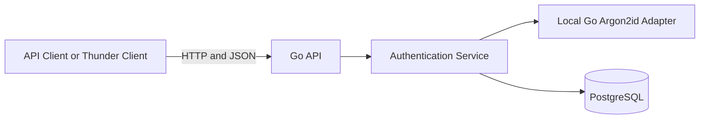
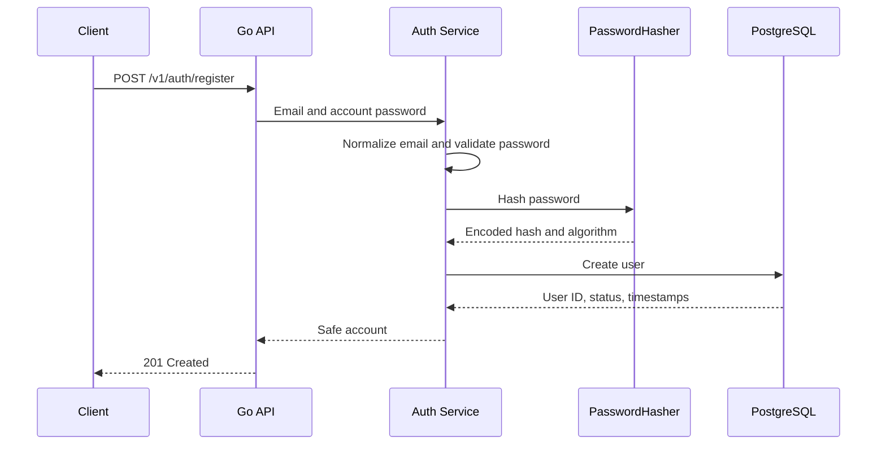
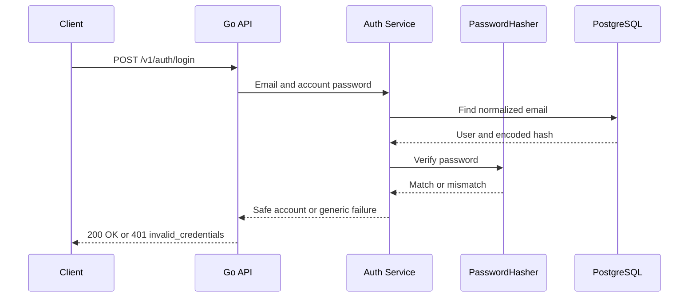
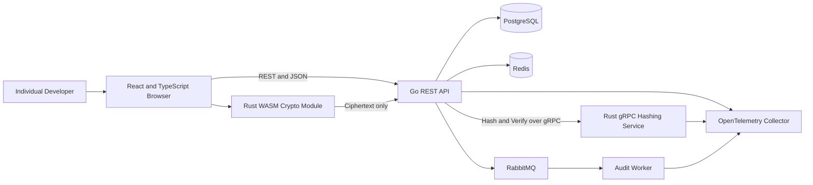

# VaultForge Architecture

## Overview

VaultForge is a backend-first developer secrets vault.

Its architecture intentionally separates:

1. Account authentication
2. Vault unlocking and encryption
3. Persistence
4. Reliability and asynchronous processing
5. Observability

The project is being built incrementally. Components marked as planned are part of the target architecture but are not currently running.

## Current architecture



### Current request flow

```text
HTTP request
    ↓
Chi router
    ↓
Request ID, safe logging, recovery, security headers, timeout
    ↓
Strict JSON decoder and body limit
    ↓
Authentication handler
    ↓
Authentication service
    ├── PasswordHasher interface
    └── UserStore interface
          ↓
      PostgreSQL
```

### Current responsibilities

#### Go API

- Exposes JSON HTTP routes.
- Handles request validation and public error mapping.
- Coordinates registration and login.
- Normalizes account emails.
- Applies account-password policy.
- Calls the replaceable password hasher.
- Persists user records through the PostgreSQL store.
- Exposes liveness and database-backed readiness routes.
- Logs safe request metadata only.

#### Local Argon2id adapter

- Implements the `PasswordHasher` interface.
- Normalizes account passwords using Unicode NFC.
- Generates a fresh random salt for each hash.
- Produces a PHC-style Argon2id encoded value.
- Verifies passwords using encoded parameters.
- Uses constant-time hash comparison.
- Rejects malformed hashes and unsafe parameter values.
- Retains no password after the operation completes.

The local adapter is temporary. It exists so the authentication contract can be completed before the Rust service is built.

#### PostgreSQL

Currently stores:

- Users
- Encoded account-password hashes
- Password algorithm identifiers
- Session-ready schema
- Vault metadata
- Opaque encrypted item payloads
- Immutable item-version records

PostgreSQL never stores plaintext account passwords or plaintext vault-item fields.

## Current account registration flow



The store receives only the encoded hash and algorithm identifier. It never receives the plaintext password.

## Current account login flow



Unknown emails, incorrect passwords, invalid login input, and disabled accounts produce the same public credentials error.

Unknown accounts also consume password-hashing work to reduce obvious timing differences.

Login does not create a session yet. Session issuance and refresh-token rotation belong to the next phase.

## Target architecture



## Target component boundaries

### Browser client

Planned responsibilities:

- Collect the account password during authentication.
- Collect the separate vault master passphrase during vault unlock.
- Derive and unwrap vault encryption keys through Rust WebAssembly.
- Encrypt vault items before upload.
- Decrypt downloaded vault items.
- Keep unwrapped keys in memory only.
- Clear application references when the vault locks.

### Go API

Current and planned responsibilities:

- Expose REST and JSON routes.
- Manage users, sessions, authorization, vault metadata, and encrypted payloads.
- Call the Rust hashing service through `PasswordHasher`.
- Store opaque encrypted envelopes.
- Coordinate Redis reliability controls.
- Write sanitized events through a transactional outbox.
- Propagate telemetry without recording sensitive values.
- Remain unable to decrypt vault contents.

### Rust hashing service

Planned responsibilities:

- Implement the existing `PasswordHasher` contract over gRPC.
- Hash and verify account passwords with Argon2id.
- Expose health and metrics.
- Enforce deadlines and bounded input.
- Retain no passwords.
- Use no application database.
- Have no access to vault data.

### Rust WebAssembly module

Planned responsibilities:

- Derive a key-encryption key from the vault master passphrase.
- Generate a random vault data-encryption key.
- Wrap and unwrap the vault key.
- Encrypt and decrypt vault items with authenticated encryption.
- Reject modified ciphertext, nonces, tags, and unsupported versions.

### Redis

Planned responsibilities:

- Rate-limit authentication and sensitive operations.
- Track short-lived failed-login state.
- Store bounded idempotency metadata where appropriate.

Redis must never store passwords, raw tokens, encryption keys, or decrypted vault data.

### RabbitMQ and audit worker

Planned responsibilities:

- Publish sanitized events from a transactional outbox.
- Process events idempotently.
- Retry transient failures.
- Route poison messages to a dead-letter queue.
- Never place secret content in messages.

## Account authentication versus vault encryption

The account password proves identity to the server.

The vault master passphrase unlocks encrypted data in the browser.

They remain separate so that:

- The server can authenticate a user without learning the vault key.
- Changing the account password does not require re-encrypting vault items.
- Changing the vault passphrase can re-wrap the vault key independently.
- The password-hashing service has no reason to access vault records.
- Backend services cannot decrypt stored vault content.

Both workflows may use Argon2id, but for different purposes, with separate parameters, salts, code, and documentation.

## Repository boundaries

```text
apps/api                Go HTTP API
apps/web                Planned React client
services/hash-service   Planned Rust gRPC hashing service
packages/proto          Planned shared Protocol Buffer contracts
deployments             Compose and later Kubernetes configuration
docs                    Architecture, threat model, decisions, and runbooks
```

## Current roadmap position

Completed:

- Product and security boundaries
- Repository and CI foundation
- Go API skeleton
- PostgreSQL schema and migrations
- Account registration and login
- Replaceable password-hashing boundary
- Real PostgreSQL and Argon2id integration tests

Next:

- Sessions
- Access tokens
- Refresh-token rotation
- Session revocation
- Authorization middleware

Later phases add vault CRUD, a minimal client, Redis, RabbitMQ, observability, Rust services, browser-side encryption, deployment, and release documentation.
